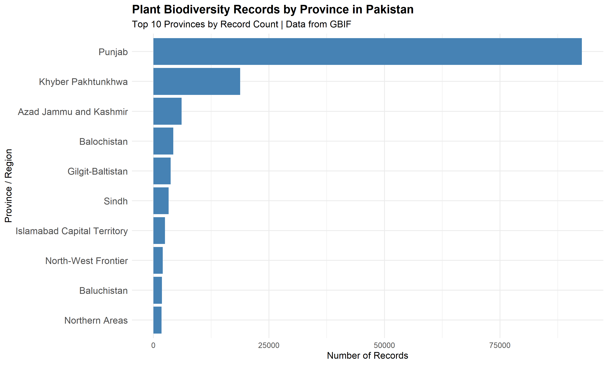
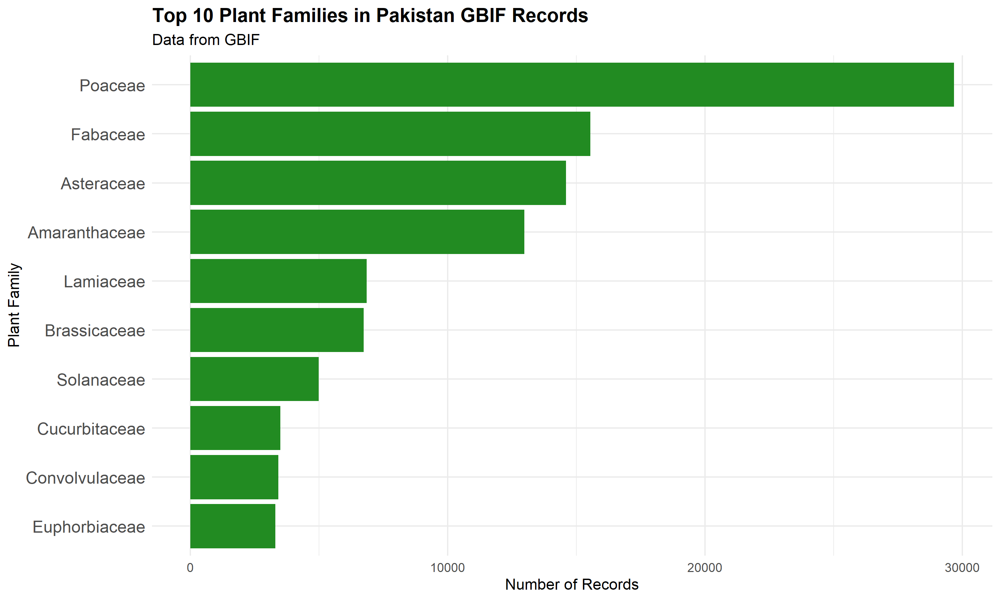
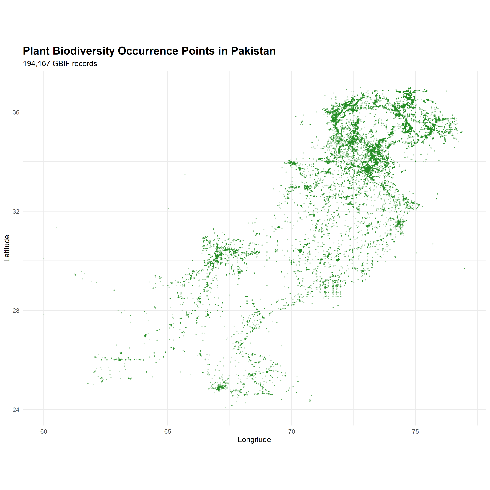
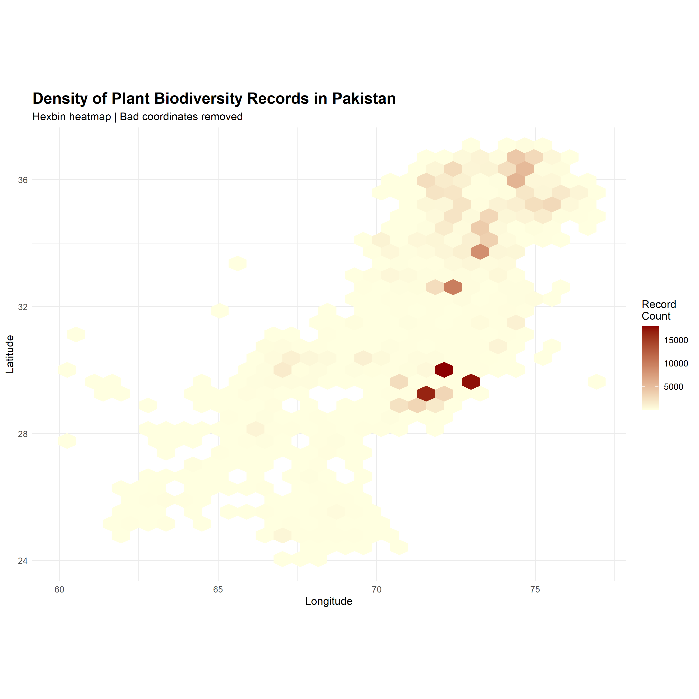
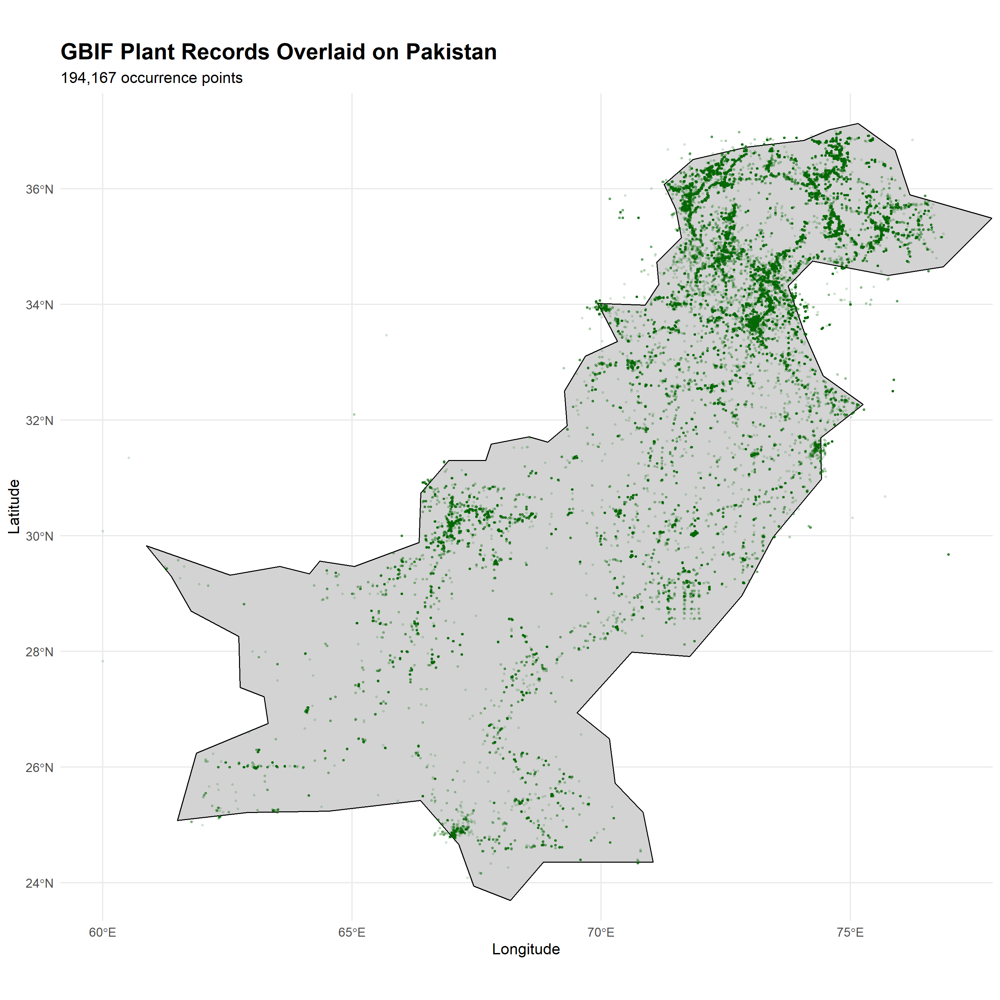
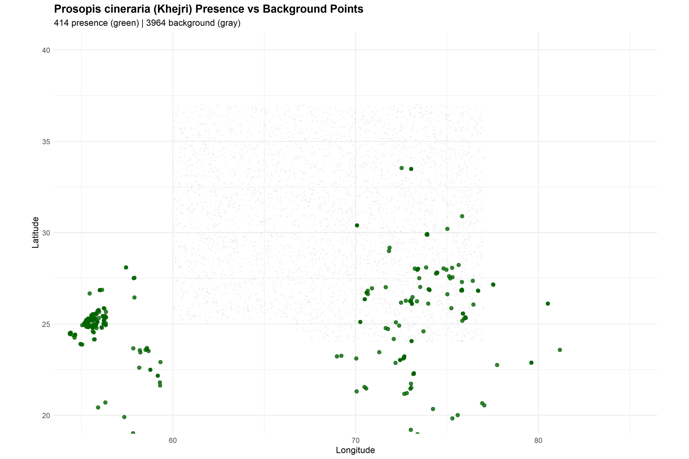

# Spatial Bias in Plant Biodiversity Data for Pakistan

**A quantitative analysis of GBIF occurrence records**

---

## Overview

This repository contains the complete analysis pipeline for examining spatial and taxonomic bias in plant biodiversity occurrence records for Pakistan, sourced from the [Global Biodiversity Information Facility (GBIF)](https://www.gbif.org/).

Pakistan is a biodiverse country spanning multiple ecoregions — from the Himalayan foothills to the Thar Desert — yet its representation in global biodiversity databases remains uneven. This project quantifies that imbalance and discusses implications for conservation planning, species distribution modeling, and ecological research in underrepresented regions.

---

## Key Findings

| Metric | Value |
|--------|-------|
| **Total records analyzed** | 123,000+ |
| **Records from Punjab Province** | 92,720 (75.2%) |
| **Records from Sindh Province** | 3,303 (2.7%) |
| **Dominant plant family** | Poaceae (29,681 records) |
| **Second dominant family** | Fabaceae (15,548 records) |

**Spatial bias:** 75% of all plant occurrence data originates from a single province (Punjab), leaving vast regions like Balochistan and Sindh severely underrepresented.
Spatial visualization reveals extreme clustering in the Punjab region, with dense hotspots around Lahore, Faisalabad, and Rawalpindi. Northern areas (Gilgit-Baltistan) and western regions (Balochistan) show significant data gaps despite high biodiversity value.

## Methodology

1. **Data acquisition:** Downloaded all Plantae occurrence records for Pakistan from GBIF (August 2025).
2. **Data cleaning:** Selected relevant columns (`stateProvince`, `family`, `species`, `eventDate`, `decimalLatitude`, `decimalLongitude`); removed records with missing province data.
3. **Spatial analysis:** Aggregated records by province/region; identified top 10 contributors.
4. **Taxonomic analysis:** Aggregated records by plant family; identified top 10 families.
5. **Visualization:** Generated publication-quality charts using `ggplot2` in R.

**Tools:** R, `dplyr`, `ggplot2`, `readr`

---

## Files

| File | Description |
|------|-------------|
| `gbif_analysis.R` | Complete R script for data cleaning, analysis, and visualization |
| `gbif_pakistan_cleaned.csv` | Cleaned dataset (123,000+ records, 6 columns) |
| `chart_province_records.png` | Bar chart: Top 10 provinces by record count |
| `chart_top_families.png` | Bar chart: Top 10 plant families by record count |
| `week2_maps.R` | R script for spatial visualization (3 maps) |
| `map_1_occurrence_points.png` | All occurrence points as green dots (Pakistan only) |
| `map_2_hexbin_density.png` | Hexbin heatmap showing spatial concentration |
| `map_3_pakistan_base.png` | Points overlaid on Pakistan country boundary |
---
| `week3_sdm_data.R` | SDM data preparation script for Prosopis cineraria |
| `prosopis_cineraria_global.csv` | 413 global occurrence records for Khejri |
| `khejri_presence_with_climate.csv` | Presence points with 19 bioclimatic variables |
| `khejri_background_with_climate.csv` | Background (pseudo-absence) points with climate |
| `khejri_global_distribution.png` | Global distribution map of Khejri |
| `khejri_presence_background.png` | Presence vs background points visualization |

## Citation

This analysis is published on Zenodo:

&gt; Naveed, A. (2026). *Spatial Bias in Plant Biodiversity Data for Pakistan: A Quantitative Analysis of GBIF Records*. Zenodo. https://doi.org/10.5281/zenodo.22140857

---

## Author

**Aamna Naveed**  
BSc Biotechnology, Islamia University of Bahawalpur  
Research interests: Biodiversity informatics, spatial ecology, computational biology  
GitHub: [@AamnaNaveed](https://github.com/AamnaNaveed)

## Data Visualization

### Records by Province

### Top 10 Plant Families

## Spatial Visualization

### Occurrence Points Map

### Density Heatmap

### Points on Pakistan Boundary

## Species Distribution Modeling (In Progress)

**Target species:** *Prosopis cineraria* (Khejri / Tree of Life)  
**Status:** Data preparation complete (Week 3 of 6)  
**Next:** MaxEnt modeling and suitability mapping (Week 4)

This project uses 413 global occurrence records and 19 WorldClim bioclimatic variables to predict the potential distribution of Khejri across Pakistan.
---

### Khejri Global Distribution

### Presence vs Background Points

## Related Work

This project is part of a broader research portfolio on Pakistan's biodiversity data quality:

- **Data Quality Audit** (2026): [DOI: 10.5281/zenodo.22199329](https://doi.org/10.5281/zenodo.22199329) — Automated audit of 195,453 GBIF plant records; 39.3% flagged with spatial errors.
- **Species Distribution Model** (2026): [DOI: 10.5281/zenodo.22174696](https://doi.org/10.5281/zenodo.22174696) — SDM for *Prosopis cineraria* using WorldClim bioclimatic variables.

## License

This project is released under the MIT License. Data sourced from GBIF under CC0 1.0.
